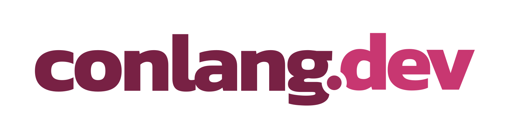

<div align="center">
<br><div></div>

[![Build status][shields-ci]][github-ci]

**conlang.dev** is a tool for conlangers and linguists to document their languages.
</div>

## 🐻 Project Overview
This project uses
* [Next.js][next] as a [React][react] framework
  * [Redux][redux] (via [Redux Toolkit][toolkit]) for state management (persisted with [redux-persist][persist])
* [Typescript][ts] for typesafe JS code
  * [ESLint][eslint] for code checking
  * [Prettier][prettier] as an opinionated code formatter
* [Chakra UI][chakra] for reactive and accessible UI
  * [React Icons][icons] for icons
* [axios][axios] for API communication with the back-end

## 🛣️ Roadmap
Find the full roadmap on [Trello][trello]

## 🏄 Setup
To get the project set up locally, just clone, install and Bob's yer (figurative) uncle.
```sh
git clone https://github.com/myriolang/conlang-dev.git
cd conlang-dev
yarn
```
You can run the development server with `yarn dev`. All code should pass linting (`yarn lint`)

[shields-ci]: https://img.shields.io/github/workflow/status/myriolang/conlang-dev/main
[github-ci]: https://github.com/myriolang/conlang-dev/actions/workflows/main.yml
[next]: https://nextjs.org/
[react]: https://reactjs.org/
[redux]: https://redux.js.org/
[toolkit]: https://redux-toolkit.js.org/
[chakra]: https://chakra-ui.com/
[persist]: https://github.com/rt2zz/redux-persist
[axios]: https://axios-http.com/
[ts]: https://www.typescriptlang.org/
[eslint]: https://eslint.org/
[prettier]: https://prettier.io/
[icons]: https://react-icons.github.io/react-icons/
[trello]: https://trello.com/b/prSeXglQ